# EASY Grocery Tracker

The "EASY Grocery Tracker" is a web application designed to meet the basic needs of managing a grocery list in the everyday life, which can be tedious task if you are not organised. It allows users to organise their grocery items in default or customised categories and allows adding/removing items required in each category. Importantly, the users can also tick-off items from their list once they are picked up in the grocery store while out shopping, which helps make the shopping experience more efficient and also allows keeping recurring items on the list instead of removing them completely.

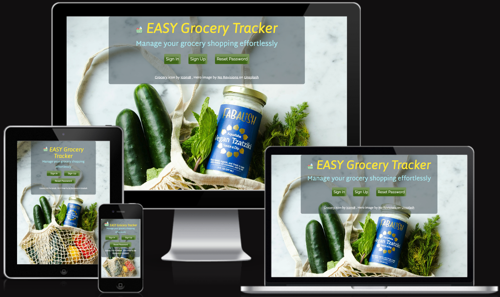

[View the Live website](https://dimispapa.github.io/easy-grocery-tracker/)

## UX Design

The design follows an analysis done using the five Ss: Strategy, Scope, Features, Structure, Skeleton, Surface.
The following key elements were considered in the design process:

### Strategy

#### User needs:

- Manage the grocery list centrally on a web app by tracking/adding/removing items while at the household and at the grocery store.
- Being able to add items to a list wherever they are and whenever they remember that they need something.
- Able to define the quantity and units of the items on the list.
- Easily refer back to the list by keeping items organised in categories.
- Share the list with other members of the household if needed.

#### Application goals:

- Create a user-friendly tracker that allows the users to perform basic grocery list tracking and management, including adding/removing/editing categories and items.
- Make a responsive a mobile-first design to ensure that it works well on the mobile, as the tracker is intended to be used at the grocery store while shopping to refer to and update the lists.
- Have the ability to retain lists in memory when the user resumes the app or refreshes, at least on the same device and browser.
- Having the option to share access to the list to other people or download the list in a shareable format.

#### Analysis:

| Application Feature                                                                                           | Importance (scale 1-5) | Viability/Feasibility |
| ------------------------------------------------------------------------------------------------------------- | ---------------------- | --------------------- |
| Create a basic application structure with section for each category and an editable list within each category | 5                      | 5                     |
| For better UX, the category section to show/hide on user's demand                                             | 3                      | 3                     |
| Buttons are used to add/remove/tick list items and to add/remove category sections                            | 5                      | 5                     |
| Have a quantity input field and unit of measurement dropdown with input validation                            | 2                      | 4                     |
| Have a retainable list on local memory of a single device/browser                                             | 5                      | 3                     |
| Give access to the list on other devices                                                                      | 2                      | 2                     |
| Option to download/export the list in a shareable format                                                      | 3                      | 3                     |
| **SUM OF IMPORTANCE / VIABILITY**                                                                             | **25**                 | **25**                |

_The above analysis indicates that we are in a position to implement all features. However, we will follow an approach of implementing by order of importance/priority to ensure that the basic demands of the app are met in the timeframe and resources available._

### Scope

#### Usage Scenarios

1. Primary household shopper:

   - Adds items that are missing from their household, needed to buy from the grocery store. If a specific quantity is required, then specifies that next to the item, otherwise leaves the quantity box empty.
   - Creates a new category if any of the default ones do not represent an item, otherwise adds an item to an existing one.
   - Re-visits the list at the grocery store and ticks off items as they place them into their basket.
   - Shares the list to another household members so that they can do the shopping or edit the list themselves.

2. Secondary household member:
   - Get access to the list shared by the primary household shopper to perform any of the above tasks on the behalf of the household.

### Structure

#### Main Audience:

The average household grocery shopper with an access to a mobile phone and an interest in using technology to make their everyday life more efficient.

#### Principles of organisation:

The nature the app, its use and its audience, dictate a linear and simple structure to the app, wherea: a landing page initially informs the user what this is about and the actual app once clicked is on a single page in the form of an interactive list with intuitive navigation.

### Skeleton

1. Index page:

   - A landing page with a hero image showing some grocery bags and a button that clearly indicates to the user that if they proceed further, they will start making a list for grocery shopping.
   - Authentication options on landing page to provide access to the app.

2. Tracker page:
   - The main application interface with the grocery list broken down into sections of categories with nested lists in each of them.
   - Buttons allow the user to hide/show each category section, add items to a section, tick/cross-off an item, delete an item and finally add a category.

### Colour Scheme

The colour scheme was generated with the help of [coolors.co](https://coolors.co/8bc34a-477116-37474f-b2ebf2-ffeb3b-d32f2f) colour palette generator. The choice was made on the basis of getting a few different colours to resemble how a grocery bag usually has different colours. A choice of vibrant colours with contrast where required to make some buttons and app elements stick out more for an easier and clearer use while on the go.

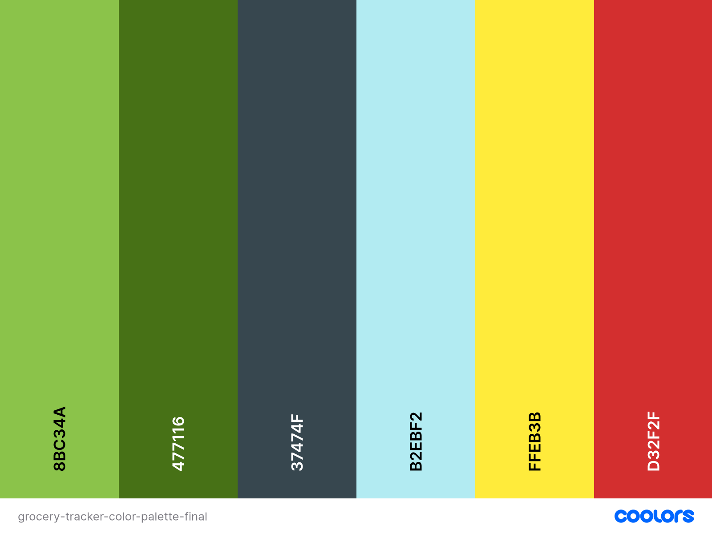

### Typography

To explore various font options and combinations, [fontjoy.com](https://fontjoy.com/) was utilised with the choice of a balance contrast between fonts. [Google Fonts](https://fonts.google.com/) was used to source the fonts for the project.

- [Asap](https://fonts.google.com/specimen/Asap) was used for primary headers.
- [Raleway](https://fonts.google.com/specimen/Raleway) was used for secondary headers.
- [Martel Sans](https://fonts.google.com/specimen/Martel+Sans) was used for main body text.

## Wireframes

Wireframes were developed using [Figma](https://www.figma.com/) focusing on mobile screen size, created with largely responsive mobile-first design and applying small changes to style/UX for larger screens.

### Mobile Wireframe

The mobile wireframe was created for the Tracker page only with greater focus placed on the main app UX design.

Click here to see the Mobile Wireframe for the Tracker page (main app page)

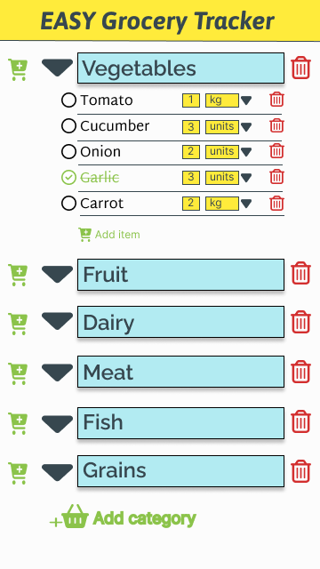

## Features

### Current Features

#### Category areas

1. New category input box and button.  

Screenshot

   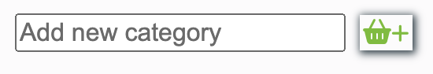

2. A category section created for each new category, with an editable list within each category
3. A new category input box and button are created below each newly-added category to allow adding categories in between, when a specific order is preferred. 

Screenshot

   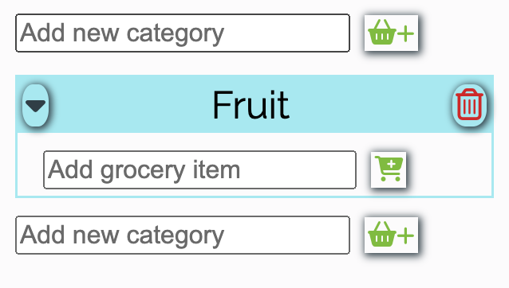

#### List Item areas

1. New item input box and button to add items within each category.   

Screenshot

   

2. Dropdown button to show/hide a category list. 

Screenshot

   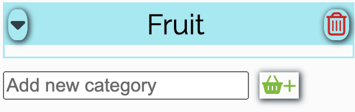
   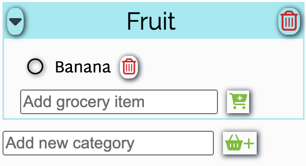

3. Tick-off button to cross-off items from the list without deleting them. This can be reversed by clicking again to un-tick, a useful feature when grocery items are recurring.  

Screenshot

   
   

#### Delete buttons

1. Delete button to delete a whole category.
2. Delete button to delete a list item within a category.

#### Input validation

1. Validation checks for blank or duplicate user inputs, with error message prompt below the input box. The duplicate validation check is case-insensitive.   

Screenshot

   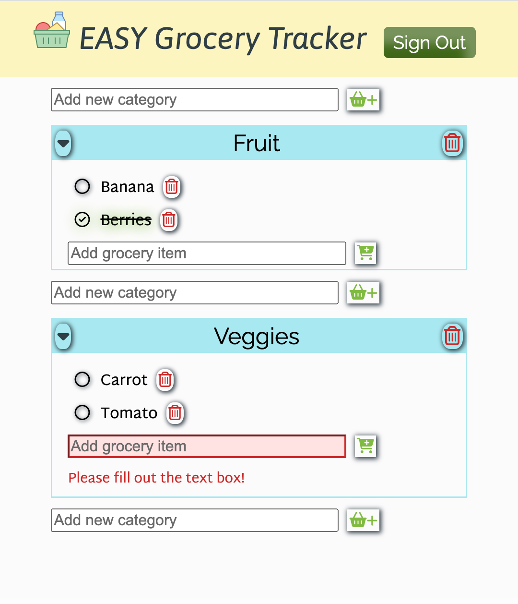
   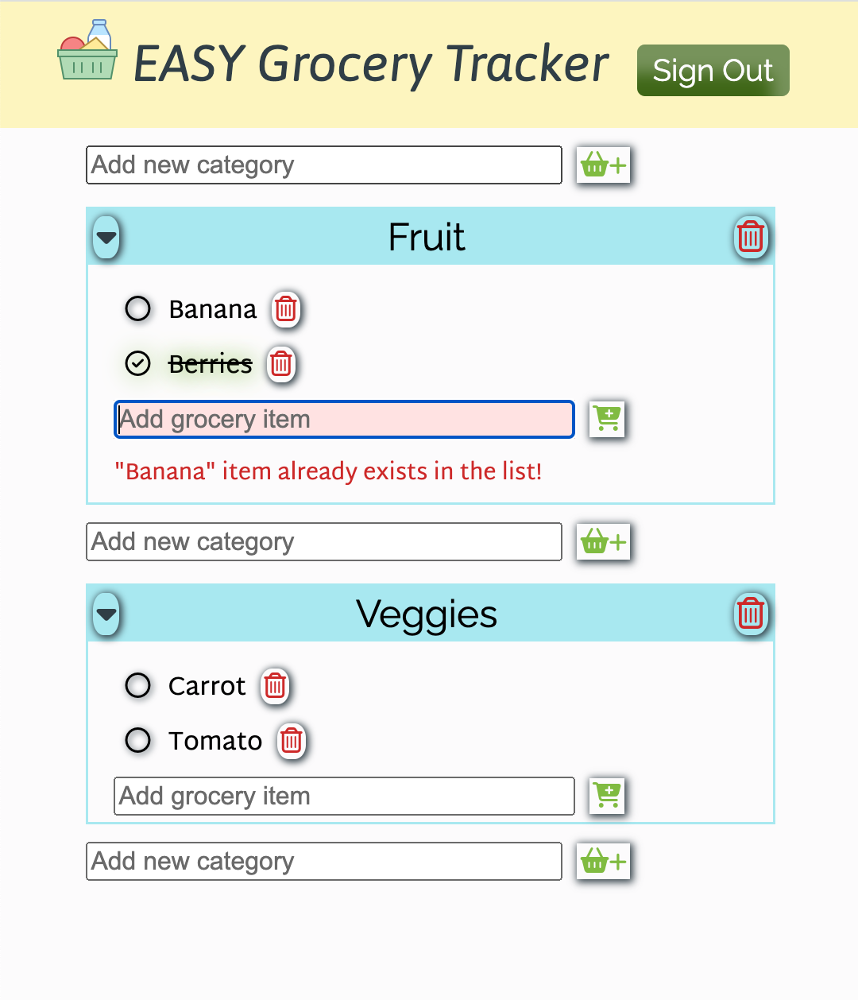
   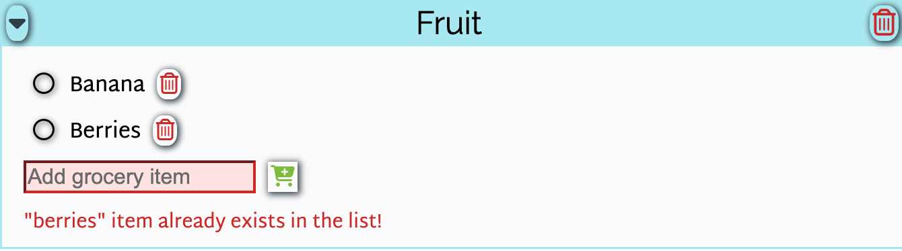
   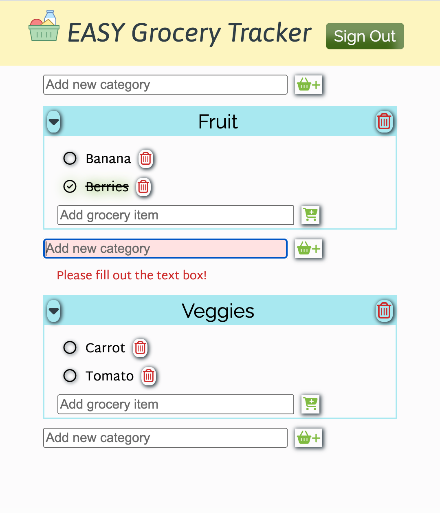
   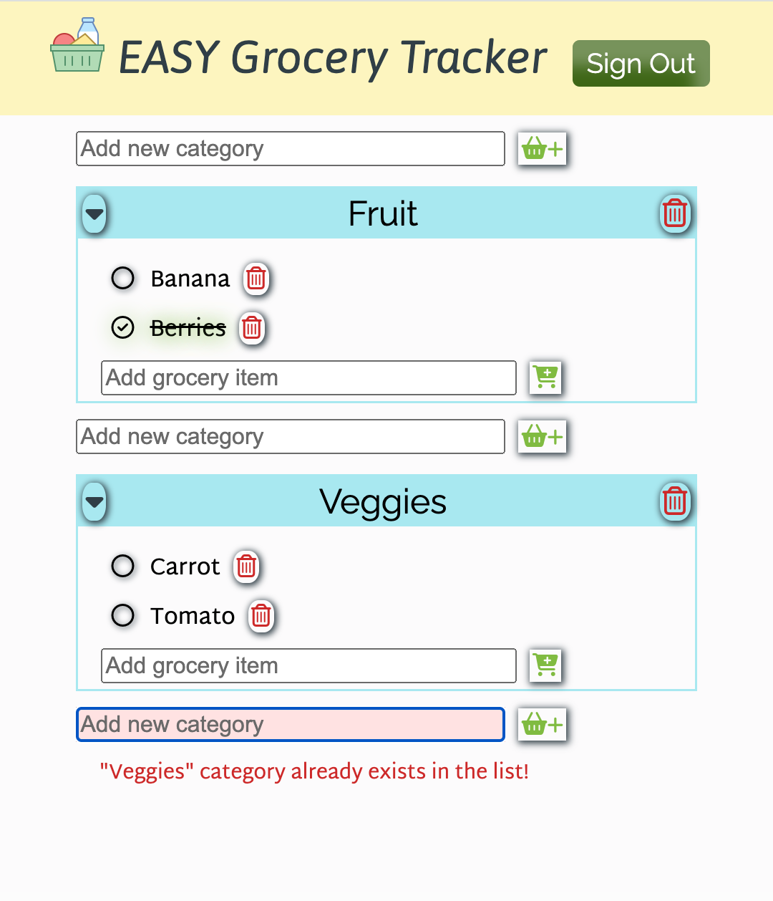

2. Error message disappears when user focuses out of the input box, allowing for a better UX.

#### Authentication, Data Storage and User Access

1. Authentication setup allows options for user access management, data retention and allowing multiple lists/users served by the database. This also allows other users to access the same list if accessing with the same credentials and therefore sharing access.
2. Real-time database backend service by Firebase, allows real-time changes to apply accross devices, to allow simultaneous changes accross devices.
3. If once logged-in, internet access is lost, the app is still operational and any changes made are stored locally and updated with the database once connection is resumed.
3. Authentication errors aree shown on page with clear reasons for errror.  

Screenshot

   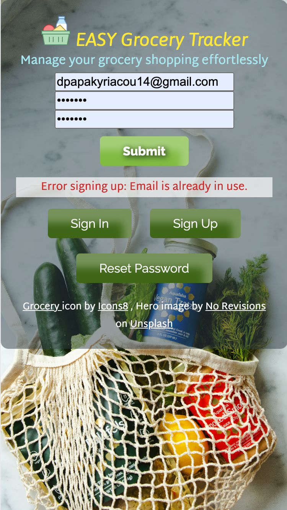
   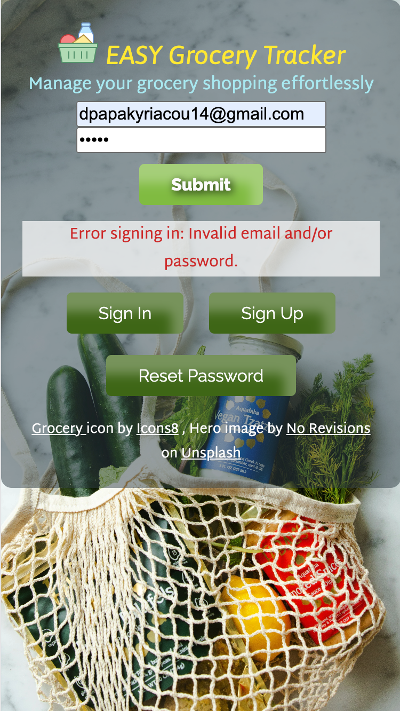
   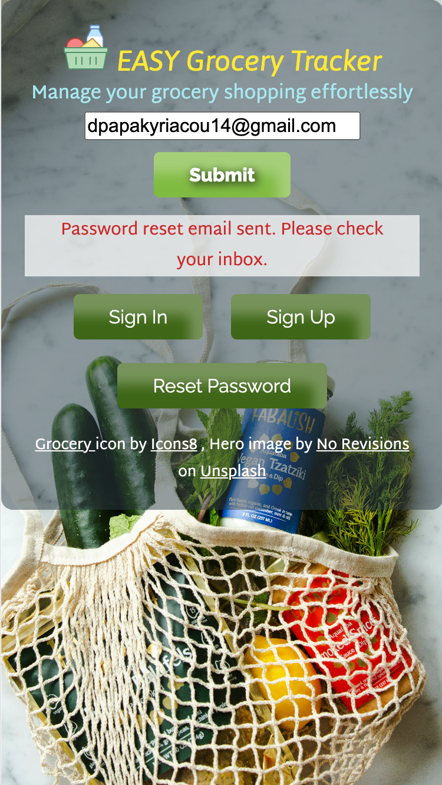
   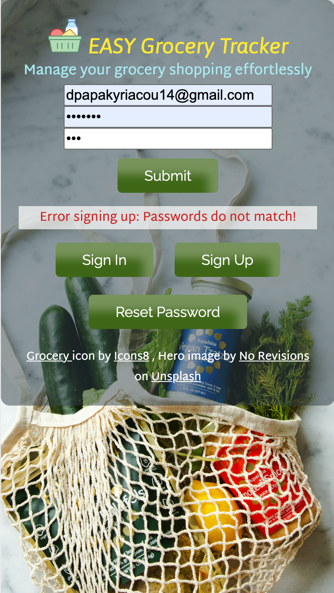

4. The index/landing page authentication options allow the user to choose between "Sign In", "Sign Up" and "Reset Password". The appropriate form becomes visible when the user toggles between the options. 

Screenshot

   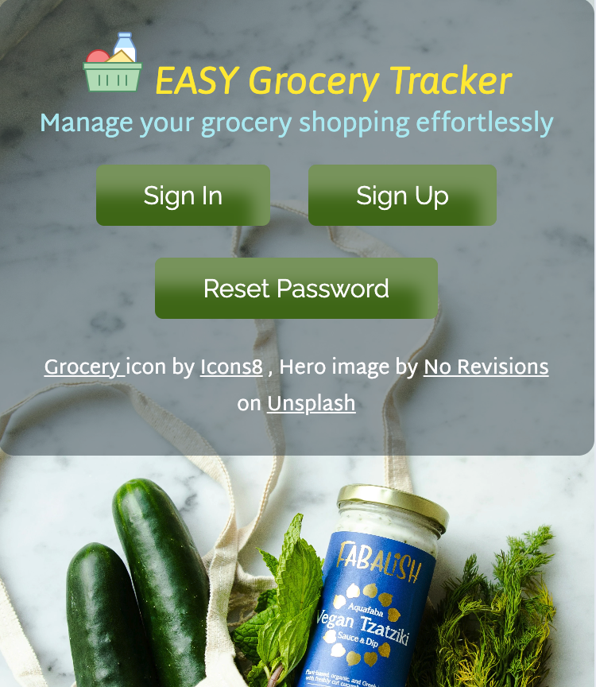
   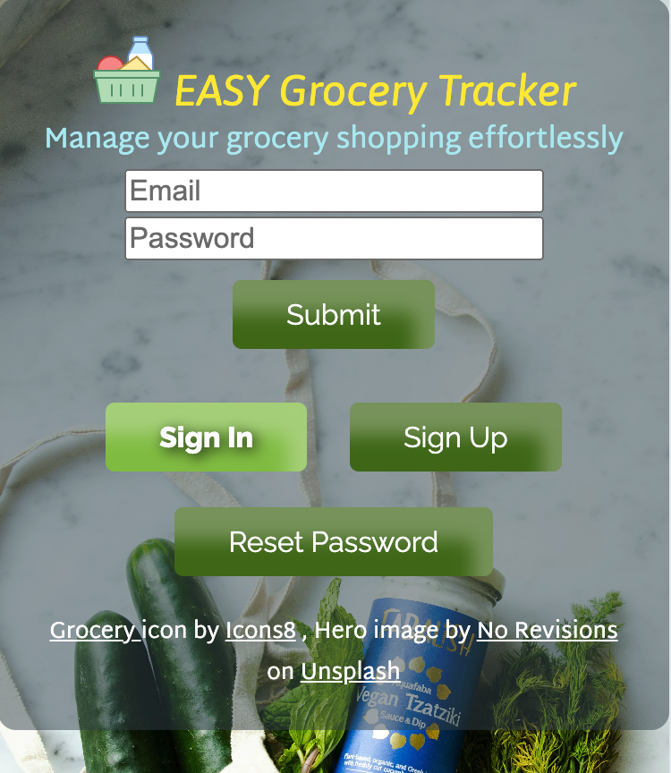
   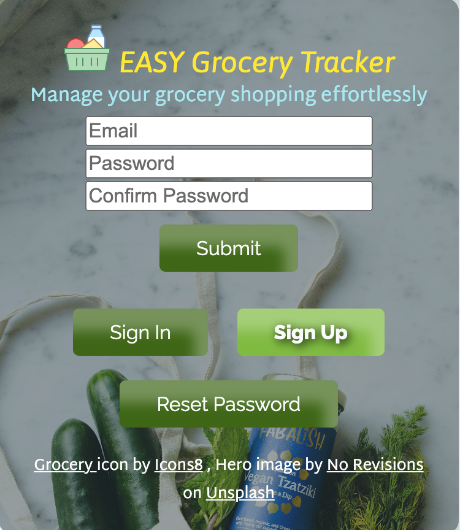
   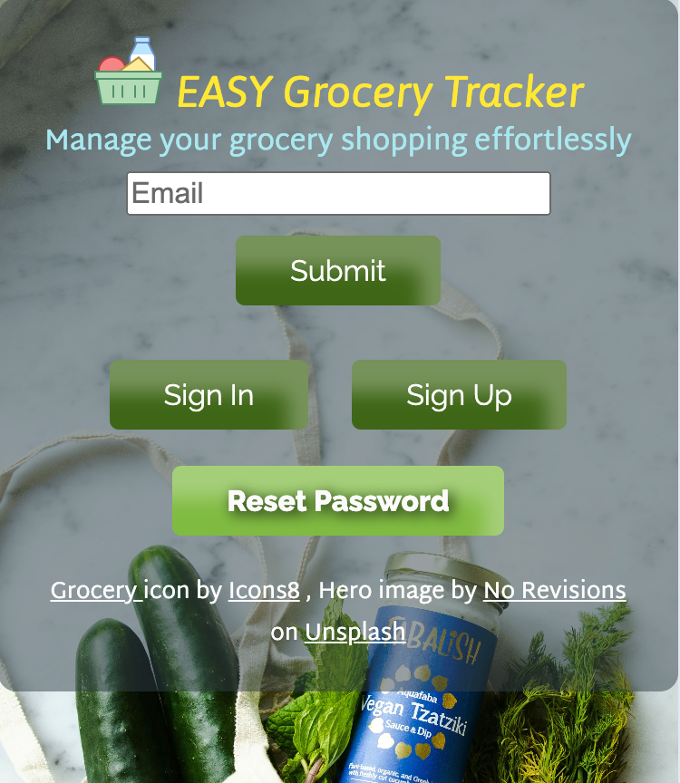

#### Saving/Loading/Populating Lists

1. Functions are set-up to read data from the DOM elements and parse them into a nested data structure with arrays/objects, that represend categories and their corresponding items.
2. Other functions are used to load data from the Firebase real-time database, using the "onValue" listener function to listen for any changes on the database that triggers the data load and re-populates the list. (e.g. on the case of shared lists and use on multiple devices).
3. A function clears the main app area from all elements except a permanent "add-category" input box and its button.
4. Some other functions are also used to populate the DOM with the fetched data, with the use of template literals and variables to dynamically generate HTML, by looping through categories and items.

#### Event Listeners

1. When user presses "Enter" key, the app responds with adding a category or item if the user is focused on an input box. When on the landing page, this will conditionally submit the form that is unhidden i.e. the form that the user chose to submit.
2. Event listeners get updated via a function that loops through buttons on the DOM, each time a new category or item is added, therefore requiring "click" event listeners on its corresponding buttons. The appropriate event listener and handler function gets applied based on classes or ids of elements.

#### Error handling principles

1. Errors get handled in each function, deliberately logging the error in the console and showing an error on page to notify the user if necessary.

### Future Features

#### Features assessed at design phase but Not Implemented due to resource constraints

1. Quantity input field not implemented, as it was seen a lower priority compared to other features. Can be implemented in a future release.
2. Downloading list in a shareable format not implemented due to time constraints and lower priority.

#### Features not assessed on design phase but Considered for future releases

1. An improvement of list-sharing will be the addition of a feature that allows users to invite user access on their list via email. This will be coupled with the capability of users being able to have multiple lists through their account and being able to select a list upon login.
2. Another additional authentication feature for future release, is to make use of Firebase's Anonymous signup, whereas a user can use the app as a guest and then optionally signup by retaining the list they have created under their new account retrospectively.

## Tech Stack & Tools utilised

- **HTML** was utilised for the main site architecture and content.
- **CSS** was utilised mainly for styling, design, layout and limited interactivity.
- **JavaScript** was utilised for:
  - Targetting HTML elements
  - DOM manipulation by UI interaction from the user
  - CSS flexible styling of HTML elements based on user interaction
  - Communication with the database for:
    - retrieving data from the DB and populating the DOM
    - authenticating and handling user access
    - processing data from the DOM and storing on the DB
  - Setting up event listeners and functionality
  - Validating user inputs and error messages
  - Controlling the general flow of the web app
- **Git** was utilised for version control, using mainly "stage", "commit" and "push" for developed features and "stash" for partly-developed features for future deployment.
- **Gitpod** was used as a cloud-based workspace to host development.
- **VS Code Desktop** was utilised as the IDE connected to the Gitpod workspace.
- **GitHub** was utilised for storing the web app resources in a secure cloud depository along with documentation.
- **GitHub Pages** was utilised for the live deployment of the website.
- **Chrome DevTools** was used for CSS styling experimentation, JavaScript debugging/testing and frequent preview of changes before committing.
- **Figma** was used for designing wireframes.
- **ChatGPT4** was used for mundane tasks such as generating docstrings for functions and help brainstorm solutions.
- **Convertio.co** was utilised to convert jpeg/png images to webp format.
- **FontAwesome** kit was used for icons.
- **Firebase** BaaS was utilised, specificaly the "Realtime Database" and "Authentication" service products.

## Testing

### Code Validation

#### HTML

HTML files were validated using the recommended [HTML W3C Validator](https://validator.w3.org).

| Page    | W3C URL                                                                                                    | Screenshot                                                       | Notes           |
| ------- | ---------------------------------------------------------------------------------------------------------- | ---------------------------------------------------------------- | --------------- |
| Index   | [W3C](https://validator.w3.org/nu/?doc=https%3A%2F%2Fdimispapa.github.io%2Feasy-grocery-tracker%2Findex.html)   | 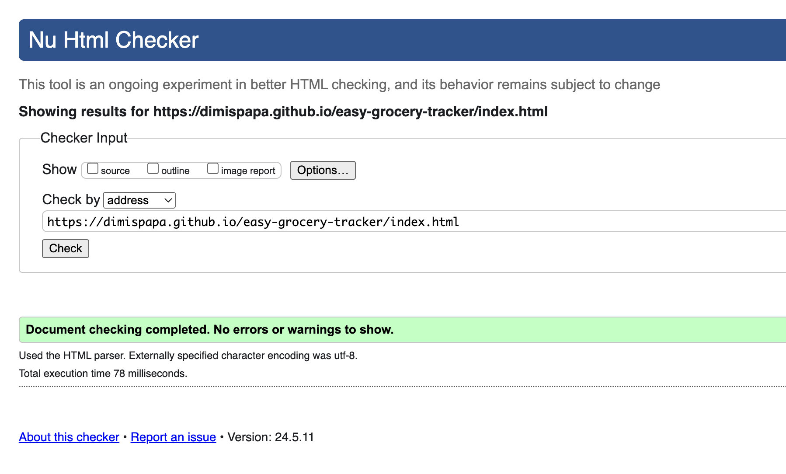   | Pass: No Errors. |
| Tracker | [W3C](https://validator.w3.org/nu/?doc=https%3A%2F%2Fdimispapa.github.io%2Feasy-grocery-tracker%2Ftracker.html) | 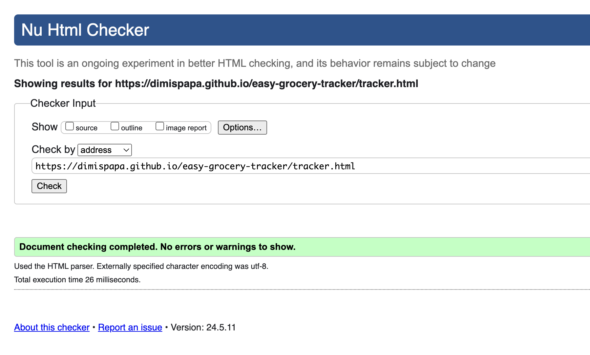 | Pass: No Errors. |

#### CSS

The CSS stylesheet was validated using the recommended [W3C CSS "Jigsaw" Validator](https://jigsaw.w3.org/css-validator).

| File      | Jigsaw URL | Screenshot | Notes | Comment |
| --------- | ---------- | ---------- | ----- | ------- |
| style.css | [Jigsaw](https://jigsaw.w3.org/css-validator/validator?uri=https%3A%2F%2Fdimispapa.github.io%2Feasy-grocery-tracker%2Findex.html) | 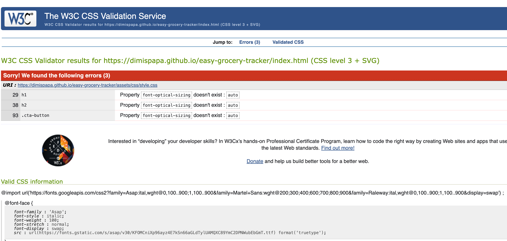 | Three identical errors: Property font-optical-sizing doesn't exist : auto | This CSS property does exist as documented by [MDN](https://developer.mozilla.org/en-US/docs/Web/CSS/font-optical-sizing). 

 This style rule is associated with the "Asap" and "Raleway" font properties as pulled from Google Fonts.
 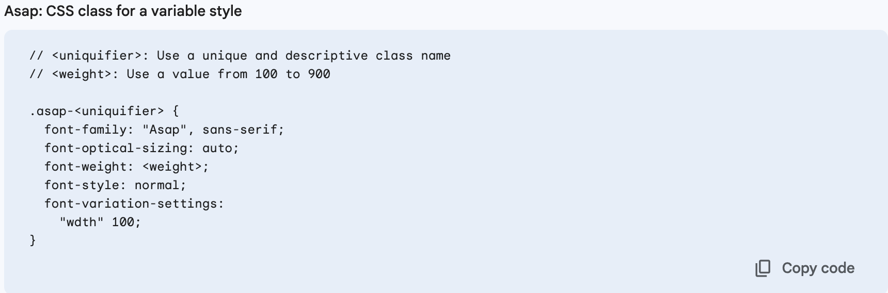 
 Pass: No issues.

#### JavaScript

The JavaScript scripts were validated using the recommended [JSHint Validator](https://jshint.com/).

| File      | Screenshot | Notes | Comment |
| --------- | ---------- | ----- | ------- |
| index.js  | 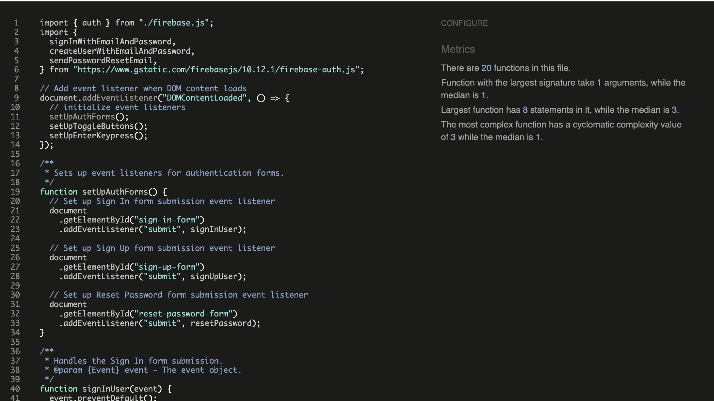 | Pass: No errors. | N/A |
| firebase.js | 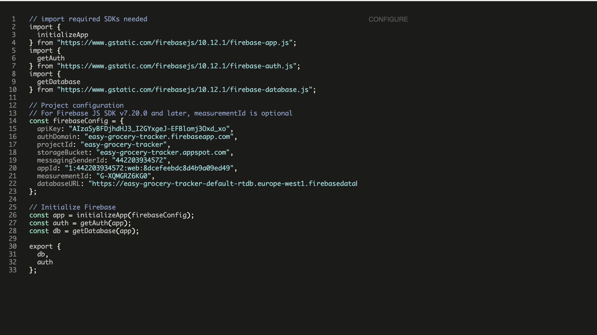 | Pass: No errors. | N/A |
| app.js | 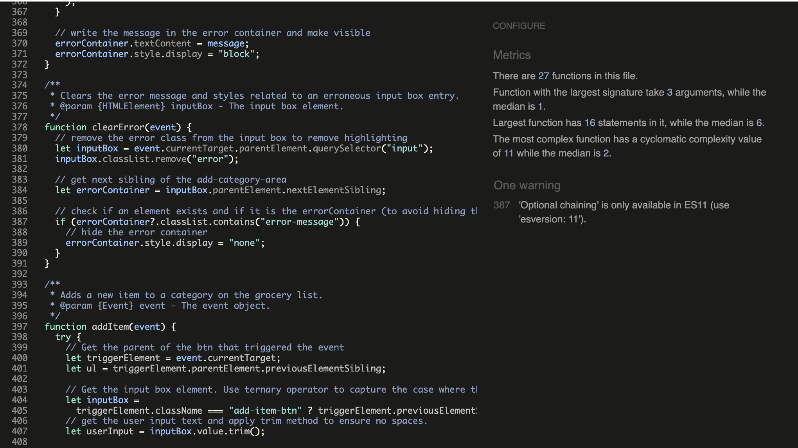 | Pass: No issues. | One warning: 'Optional chaining' used in line 387 (used for clearer and concise code, avoids an extra nested if) is only available in ES11.

### Lighthouse Audit

A test was carried out on the deployed website, for the relevant areas using the Lighthouse Audit tool within Chrome Dev Tools:
| Page             | Size    | Screenshot                                                        | Notes               |
| ---------------- | ------- | ----------------------------------------------------------------- | ------------------- |
| Index             | Mobile  | 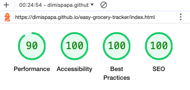 | No major problems  |
| Index             | Desktop | 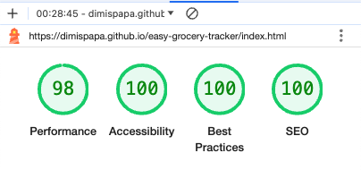    | No major problems   |
| Tracker           | Mobile  |     | No major problems   |
| Tracker           | Desktop | 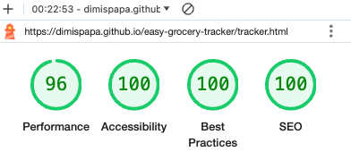   | No major problems   |

### Browser Compatibility

The deployed project was tested on Chrome and Safari for compatibility issues.

| Browser | Index | Tracker | Notes |
| ------- | ------|---------|-------|
| Chrome Mobile |||No issues noted |
| Chrome Desktop |    | 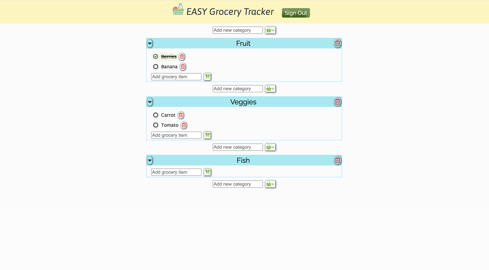   |  No issues noted        |
| Safari Mobile  | | 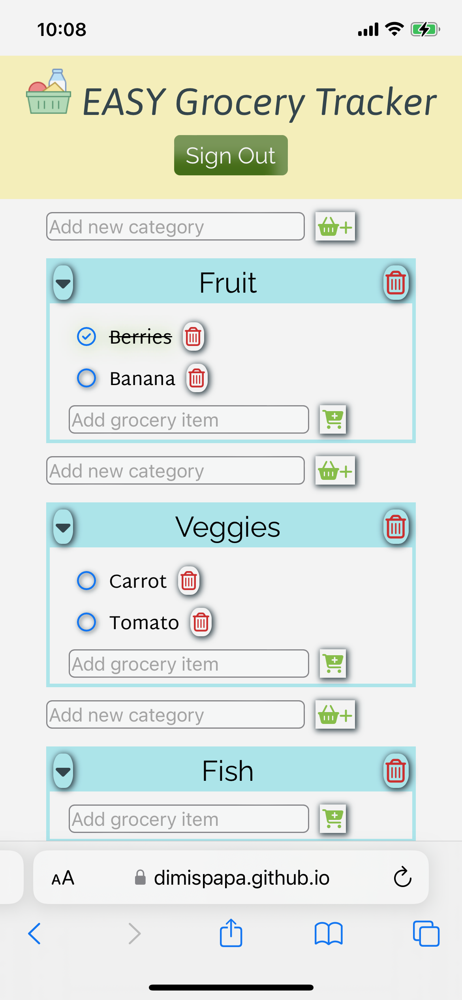 | No issues noted         |
| Safari Desktop |              | 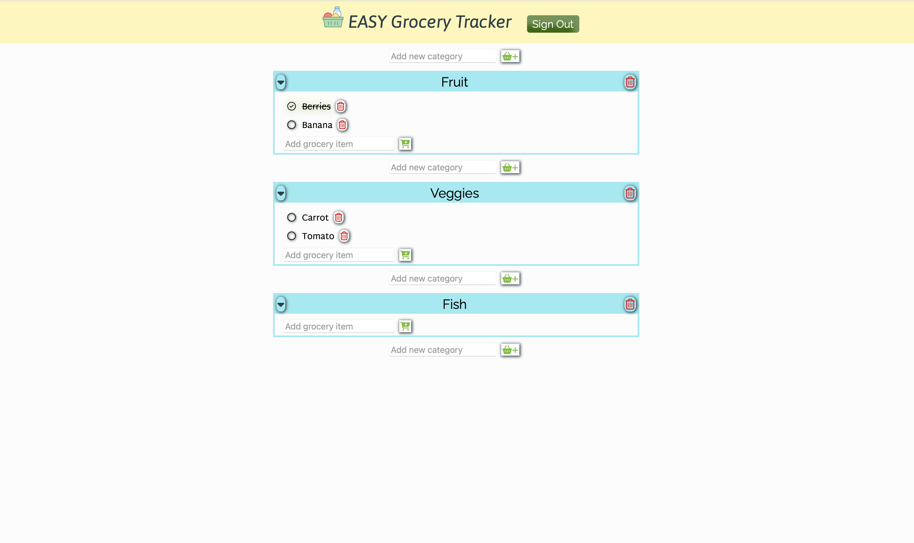             |  No issues noted       |

### Device Bug Testing - Responsiveness

The web app responsiveness and functionality was tested on the following physical devices, in addition to testing on Chrome DevTools on a variety of devices:

* iPhone 12 Pro - iOS 17.4.1:
    | Index | Tracker | 
    | ---------- | ---------- | 
    |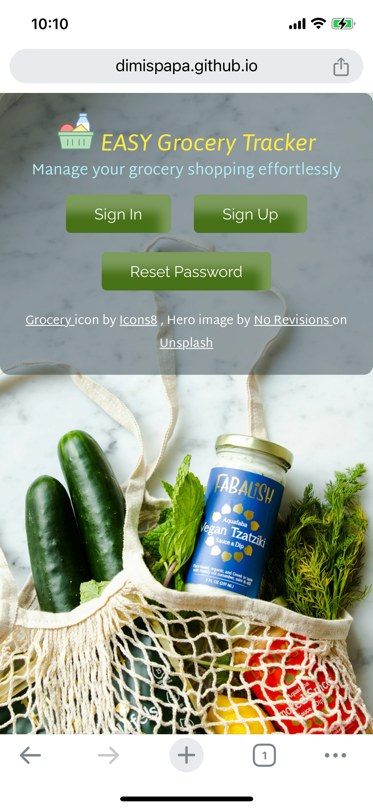 |   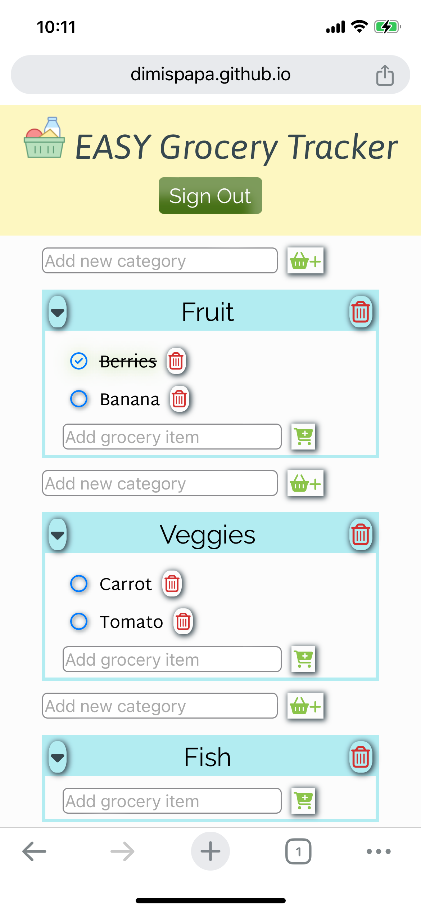 |

Result: Operates as expected

* MacBook Pro 15-inch 2018- macOS Sonoma 14.3.1:
    | Index | Tracker | 
    | ---------- | ---------- | 
    | |    |

Result: Operates as expected

## Deployment
The site was deployed to GitHub Pages. The steps to deploy were as follows:
* Navigate to the "Settings" tab in the [GitHub repository](https://github.com/dimispapa/cy_boulder_fest).
* Go to "Pages" in the "Code and automation" section.
* Under the "Build and deployment" section, select the **Main** branch in the dropdown, ensure the "root" folder is selected, and then click "Save".
* The page will be automatically refreshed with a detailed ribbon display to indicate the successful deployment.
* The page might take a few minutes to be fully deployed and live. Can monitor the "Deployments" ribbon back in the main GitHub repository.

[Click here to view the live deployed website](https://dimispapa.github.io/easy-grocery-tracker/)

## Credits

### Technical
| Source                                        | Use                       | Notes                                                  |
| --------------------------------------------- | ------------------------- | ------------------------------------------------------ |
| [Conventional Commits](https://www.conventionalcommits.org/en/v1.0.0/#summary) | Version Control | Help write Git commit messages |
| [Bouldering Favicon by Icons8](https://icons8.com) | Favicon on page head | Multiple resolutions used to avoid rendering issues |
| [Fontjoy](https://fontjoy.com/) | Font Pairing | Used to generate font combinations |
| [Google Fonts](https://fonts.google.com/) | Imported Fonts | Imported in stylesheet |
| [Firebase - Realtime Database](https://firebase.google.com/docs/database/web/start?hl=en&authuser=0) | For storing lists and retrieving data | Online resources read for: Setup, Configuration, Data Structure, Database Rules, Read/Write Data, Realtime listener |
| [Firebase - Authentication](https://firebase.google.com/docs/auth/web/start?hl=en&authuser=0) | For authenticating user access and access to list data of user. Allow list access from multiple devices | Online resources read for: Setup, Configuration, Email/Password Authentication, Reset Email Password |
| [Medium.com](https://medium.com/@somaia_khalil/how-to-structure-your-javascript-code-into-different-files-21034102c7f3) | How to structure JS code in multiple files | Used method 2 with ES6 modules allowing export/import of functions/parameters |
| [MDN](https://developer.mozilla.org/en-US/docs/Web/JavaScript/Reference/Functions/Arrow_functions)| Use of Arrow functions | Allows for simpler/more concise code |
| [30secondsofcode](https://www.30secondsofcode.org/js/s/arrow-function-event-listeners/) | Use of Arrow functions as the call-back for an event listener | Used at times instead of anonymous function |
| [MDN](https://developer.mozilla.org/en-US/docs/Web/API/Document/querySelector) | querySelector() method | Used to easily target specific DOM elements when other methods require more complex chaining |
| [MDN](https://developer.mozilla.org/en-US/docs/Web/API/Document/querySelectorAll) | querySelectorAll() method | Used to easily target a group of DOM elements when other methods require more complex chaining |
|[freecodecamp](https://www.freecodecamp.org/news/javascript-insertadjacenthtml-method-efficient-dom-manipulation/#:~:text=insertAdjacentHTML%20is%20a%20method%20in,of%20a%20web%20page%20dynamically.)| insertAdjacentHTML() method | Used to populate/manipulate the grocery list DOM |
| [Rory Patrick Sheridan](https://github.com/Ri-Dearg) | Switch Case | Use of Switch Case instead of If Else in long/complex conditional statements |
| [Medium.com](https://medium.com/@michellekwong2/switch-vs-if-else-1d458e7b0711) | Switch Case vs If Else | Understanding what's better to use when|
| [Rory Patrick Sheridan](https://github.com/Ri-Dearg) | Input Errors | Encouraged to show errors on page instead of alerts for better UX/accessibility |
| [zuko.io](https://www.zuko.io/blog/a-guide-to-error-messages-in-online-forms) | Dos/Dont's for errors on forms | General guide for UX on errors |

### Content
| Source | Use | Notes | 
| ---- | ---- | ----|
| [FontAwesome](https://fontawesome.com/) | Icons | For buttons |
| [Unsplash](https://unsplash.com/) | Images | Hero image |
| [Icons8](https://icons8.com/) | Icons | Grocery Icon/Logo |

## Acknowledgements
* I would like to thank my Code Institute mentor, Rory Patrick Sheridan, for the support, useful tips and comprehensive (considering the limited timeframe) reviews during this project.
* I would like to also thank my partner, Georgina Christou, for the useful opinion when it comes to the colour scheme, fixing the overall design aesthetics and also for some basic user testing.
* I would also like to thank Code Institute for the great JavaScript content that inspired me to go out there and research further to build on my skills!